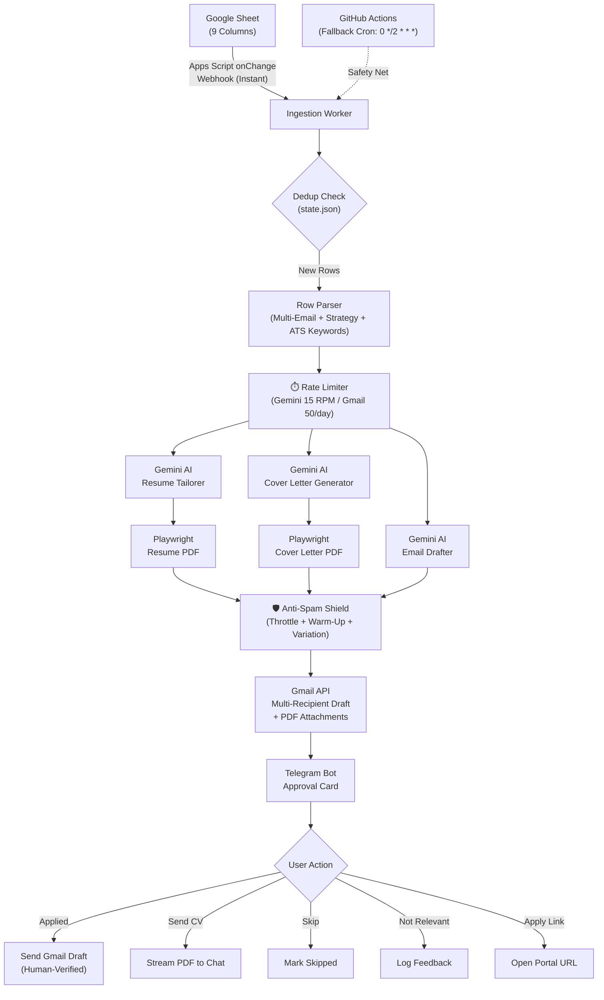
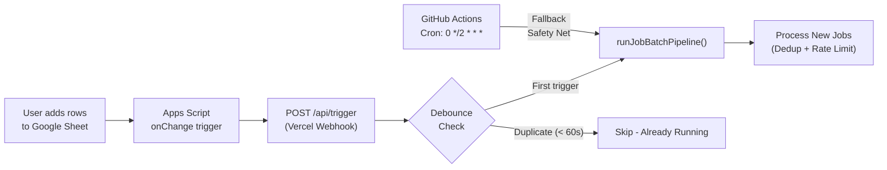

# 🗺️ MASTER PROJECT DELIVERY PLAN — Pulsereach

> **Project Name:** **Pulsereach** — Autonomous Job Outreach & Application Engine  
> **Tagline:** *"The moment a job drops, a pulse goes out. Every pulse reaches the right inbox."*  
> **Candidate:** Amaan Rizwan (*Software Engineer | TypeScript, Python, Java, Next.js, Node.js & Cloud Infrastructure*)  
> **Target Region:** United Arab Emirates (Dubai, Abu Dhabi, Sharjah, Ajman, Remote)  
> **Hosting Budget:** $0.00/month (100% Free Serverless via GitHub Actions + Vercel)  
> **Source Feed:** Google Sheet (`9 Columns` | `Instant Webhook Trigger on New Rows`)  
> **Created:** 2026-08-22  
> **Status:** 🟢 Production Complete & Verified

---

## 📋 Executive Summary

**Pulsereach** is a fully autonomous job application engine that triggers **instantly** the moment new job listings are added to a Google Sheet. Using a Google Apps Script webhook, it immediately ingests the new rows, generates AI-tailored ATS resumes, cover letters, and personalized cold emails via Gemini AI, compiles them into single-page A4 PDFs, creates multi-recipient Gmail drafts with PDF attachments, and dispatches interactive Telegram approval cards for human-in-the-loop review — all for $0/month. A GitHub Actions cron runs every 2 hours as a **safety-net fallback** to catch any rows the webhook may have missed.

This master plan is organized into **16 single-task sprints (Sprint 0 through Sprint 15)**, each focused on exactly one deliverable concern. It begins with GitHub repository creation and ends with production deployment, with comprehensive testing as the penultimate gate.

---

## 🏗️ System Architecture Overview



---

## 📐 Technology Stack

| Layer | Technologies |
|---|---|
| **Runtime** | Node.js 20+, TypeScript 5.5+, ESM Modules |
| **Package Manager** | pnpm 9+ |
| **AI Engine** | Google Gemini 2.0 Flash (Structured JSON Output) |
| **PDF Compilation** | Playwright Headless Chromium (Single-Page A4) |
| **Data Source** | Google Sheets API v4 (9-Column Schema) |
| **Email Dispatch** | Gmail API v1 (OAuth2, RFC 2822 MIME, Multi-Recipient Drafts) |
| **Mobile Cockpit** | Telegram Bot API (Inline Keyboards, Callback Queries, Document Stream) |
| **Environment Config** | Zod Schema Validation + dotenv |
| **Trigger (Primary)** | Google Apps Script `onChange` → Vercel Webhook (Instant) |
| **Trigger (Fallback)** | GitHub Actions Cron (`0 */2 * * *`) as safety-net |
| **Rate Limiting** | Custom token-bucket limiter (Gemini, Gmail, Sheets, Telegram) |
| **Anti-Spam** | Draft-first human gate, content variation, send throttling, warm-up |
| **Deployment (Free)** | GitHub Actions (Fallback Cron) + Vercel Hobby (Webhook + Telegram) |
| **State Management** | Local `state.json` (Deduplication Store) |

---

## 📂 Target Project Structure

```
pulsereach/
├── package.json
├── tsconfig.json
├── .env.example
├── .env
├── .github/
│   └── workflows/
│       └── pulse-pipeline.yml        # GitHub Actions fallback cron
├── api/
│   ├── telegram.ts                   # Vercel serverless Telegram webhook
│   └── trigger.ts                    # Vercel webhook: Google Sheets onChange trigger
├── src/
│   ├── config/
│   │   └── env.ts                    # Zod validated environment variables
│   ├── rate-limiter/
│   │   └── token-bucket.ts           # Multi-service rate limiter
│   ├── sheets/
│   │   └── sheets-client.ts          # Google Sheets API 9-column reader
│   ├── ai/
│   │   ├── candidate-catalog.ts      # Typed master candidate profile
│   │   ├── candidate-data.ts         # Simplified profile adapter
│   │   ├── resume-tailorer.ts        # Resume tailoring + ATS refinement
│   │   ├── resume-compiler.ts        # HTML/CSS A4 templates + autofit
│   │   ├── ats-evaluator.ts          # 5-factor ATS scoring model
│   │   ├── cover-letter-generator.ts # 4-paragraph cover letter engine
│   │   ├── email-generator.ts        # Cold email drafter + sanitizer
│   │   ├── followup-generator.ts     # Day 4 & Day 9 follow-up sequences
│   │   ├── conversation-classifier.ts# 8-intent recruiter classifier
│   │   ├── response-drafter.ts       # Contextual reply drafter
│   │   ├── conversational-modifier.ts# Revision engine
│   │   ├── match-evaluator.ts        # Job-candidate match scoring
│   │   ├── pdf-compiler.ts           # Playwright A4 PDF compiler
│   │   └── index.ts                  # Core AI client + rate-limited fetch
│   ├── anti-spam/
│   │   └── deliverability-shield.ts  # Email warm-up, throttle, variation
│   ├── gmail/
│   │   └── draft-service.ts          # MIME builder + Gmail Draft API
│   ├── telegram/
│   │   └── bot-service.ts            # Cards, callbacks, PDF stream
│   ├── worker/
│   │   ├── pipeline.ts               # Batch pipeline orchestrator
│   │   └── state-tracker.ts          # Deduplication state store
│   └── index.ts                      # Main entrypoint
├── prompts/
│   └── index.ts                      # Master prompt catalog
└── dist/                             # Compiled production build
```

---

## 📚 Reference Documents Index

| Document | Contents |
|---|---|
| [01_RESUME_ENGINE.md](PLAN/01_RESUME_ENGINE.md) | Candidate ground truth, resume tailoring rules, ATS scoring, A4 density budget |
| [02_COVER_LETTER_ENGINE.md](PLAN/02_COVER_LETTER_ENGINE.md) | 4-paragraph architecture, domain personalization, HTML/CSS templates |
| [03_EMAIL_DRAFTING_ENGINE.md](PLAN/03_EMAIL_DRAFTING_ENGINE.md) | Cold email standard, follow-ups (Day 4 & Day 9), recruiter intent classifier |
| [04_WHOLE_PROCESS_ARCHITECTURE.md](PLAN/04_WHOLE_PROCESS_ARCHITECTURE.md) | End-to-end workflow, Telegram cockpit, deduplication, serverless architecture |
| [05_HOW_TO_BUILD_AND_RUN.md](PLAN/05_HOW_TO_BUILD_AND_RUN.md) | Directory layout, source code files, GitHub Actions + Vercel deployment |
| [06_PHASES_AND_SPRINTS.md](PLAN/06_PHASES_AND_SPRINTS.md) | Original 6-sprint roadmap with acceptance criteria |

---

## ⏱️ API Rate Limits & Free Tier Budget

> [!IMPORTANT]
> All API calls MUST be governed by the rate limiter to stay within free tier limits. Exceeding these limits will result in `429 Too Many Requests` errors or account suspension.

| Service | Free Tier Limit | Pulsereach Budget (per trigger) | Safety Margin |
|---|---|---|---|
| **Gemini API** | 15 RPM / 1,500 RPD / 1M TPM | 24 requests (3 per job × 8 jobs) | 8 RPM max burst, 2s delay between calls |
| **Gmail API** | 250 sends/day (consumer), unlimited drafts | 8 drafts created, ≤20 sends/day | Max 20 human-approved sends per day |
| **Gmail Sending** | No official cold email limit | ≤20 sends/day (self-imposed) | Fixed 15-minute delay between every send |
| **Google Sheets API** | 60 reads/min / 300 reads/min (project) | 1-2 reads per trigger | 30s minimum between reads |
| **Telegram Bot API** | 30 msgs/sec (global), 1 msg/sec (per chat) | 8 cards + 8 callbacks per trigger | 1.5s delay between messages to same chat |
| **GitHub Actions** | 2,000 min/month (free) | ~30 sec/run × 12 runs/day (fallback only) | ~180 min/month (9% of budget) |
| **Vercel Hobby** | 100 GB bandwidth, 10s execution | Webhook triggers + Telegram callbacks | Negligible usage |

### Rate Limiter Implementation (`src/rate-limiter/token-bucket.ts`)

```typescript
// Token-bucket rate limiter with per-service configuration
interface RateLimiterConfig {
  maxTokens: number;        // Max burst capacity
  refillRate: number;       // Tokens refilled per second
  minDelayMs: number;       // Minimum delay between requests
}

const SERVICE_LIMITS: Record<string, RateLimiterConfig> = {
  gemini:   { maxTokens: 8,  refillRate: 0.25, minDelayMs: 2000 },  // 15 RPM safe
  gmail:    { maxTokens: 3,  refillRate: 0.1,  minDelayMs: 5000 },  // 250/day safe
  sheets:   { maxTokens: 2,  refillRate: 0.5,  minDelayMs: 30000 }, // 60/min safe
  telegram: { maxTokens: 1,  refillRate: 0.67, minDelayMs: 1500 },  // 1/sec/chat safe
};
```

---

## 🛡️ Anti-Spam & Email Deliverability Strategy

> [!CAUTION]
> Gmail accounts sending bulk cold emails without proper controls will be flagged as spam and potentially suspended. Pulsereach uses a **multi-layered defense strategy** to protect sender reputation.

### Layer 1: Human-in-the-Loop Gate (Primary Defense)

The most powerful anti-spam mechanism: **emails are NEVER sent automatically**. Every email goes through:

```
AI generates email → Gmail DRAFT created → Telegram card sent → 
Human reviews on phone → Taps [✅ Applied] → ONLY THEN email sends
```

This means every single outgoing email has been explicitly approved by the user. No batch blasting. No automated sending.

### Layer 2: Send Volume Throttling & Warm-Up Schedule

| Week | Max Sends/Day | Max Sends/2hr Cycle | Reasoning |
|---|---|---|---|
| Week 1 (Days 1-7) | 5 | 2 | New sender warm-up, build reputation |
| Week 2 (Days 8-14) | 10 | 3 | Gradual increase, monitor bounce rate |
| Week 3 (Days 15-21) | 15 | 4 | Moderate volume, check deliverability |
| Week 4+ (Day 22+) | 20 | 5 | Steady state, sustained reputation |

```typescript
// Anti-spam warm-up enforcer
function getMaxSendsForToday(accountAgeDays: number): number {
  if (accountAgeDays <= 7)  return 5;
  if (accountAgeDays <= 14) return 10;
  if (accountAgeDays <= 21) return 15;
  return 20;  // Never exceed 20/day for cold outreach
}
```

### Layer 3: Content Variation Engine

Every email is **uniquely generated by AI** per job listing, eliminating the #1 spam trigger (identical content):

- [ ] **Unique subject lines** — tailored to each job title and company
- [ ] **Unique opening paragraphs** — referencing specific job requirements
- [ ] **Unique value propositions** — highlighting different projects per role
- [ ] **Unique closing lines** — varied call-to-action phrasing
- [ ] **Zero template fingerprint** — no repeated boilerplate across emails

### Layer 4: Sending Pattern Humanization

- [x] **24/7 continuous operation:** Leads processed and approved sends dispatched 24/7 day and night
- [x] **Send pacing:** Fixed 15-minute cooldown between approved sends to protect Gmail reputation
- [x] **Spread across triggers:** Max 5 sends per pipeline trigger, not all at once
- [x] **Reply threading:** Follow-ups use `In-Reply-To` headers (same thread)

### Layer 5: Technical Email Authentication

- [ ] **Gmail OAuth2:** Sends from authenticated personal Gmail (not bulk sender)
- [ ] **SPF/DKIM:** Gmail handles SPF and DKIM automatically for `@gmail.com`
- [ ] **No BCC mass-sending:** Each company gets its own individual draft
- [ ] **Proper Reply-To:** Set to candidate's actual email address
- [ ] **Clean MIME:** RFC 2822 compliant, no spam-trigger headers

### Layer 6: Engagement & Reputation Monitoring

- [ ] **Track bounce rate:** If bounces > 5%, pause and review email list quality
- [ ] **Track opens/replies:** Monitor engagement ratio (target: >10% reply rate)
- [ ] **Auto-pause on flags:** If Gmail shows delivery warnings, stop sending for 48h
- [ ] **Blacklist monitoring:** Periodically check sender IP/domain against blacklists
- [ ] **Follow-up cancellation:** If recruiter replies, all pending follow-ups are cancelled

### Layer 7: Gmail Account Health Rules

- [ ] **Single sender identity:** Always `Candidate Name <you@example.com>`
- [ ] **Consistent signature:** Same professional signature on every email
- [ ] **Mixed email activity:** Account should also receive and reply to regular emails
- [ ] **Attachment size limits:** PDFs kept under 2MB each
- [ ] **No link-heavy emails:** Maximum 3 links per email (LinkedIn, GitHub, Portfolio)

### Anti-Spam Configuration (`src/anti-spam/deliverability-shield.ts`)

```typescript
interface DeliverabilityConfig {
  warmUpStartDate: string;              // ISO date when warm-up began
  maxSendsPerDay: number;               // Hard daily cap (auto-calculated from warm-up)
  maxSendsPerTrigger: number;           // Max sends per pipeline trigger
  fixedDelayBetweenSendsMs: number;     // Fixed 15-minute (900000ms) delay between sends
  businessHoursOnly: boolean;           // Only send 8 AM - 6 PM UAE Time (UTC+4)
  skipWeekends: boolean;                // No Saturday/Sunday sends
  bounceRateThreshold: number;          // Pause if bounces > this % (default: 5%)
  dailySendCount: number;               // Rolling count for today
  totalSendCount: number;               // Lifetime count for reputation tracking
}
```

---

## 🗓️ Sprint Timeline (One Task Per Sprint)

```mermaid
gantt
    title Pulsereach — Master Sprint Timeline
    dateFormat  YYYY-MM-DD
    
    section Foundation
    Sprint 0: GitHub Repo & Scaffold       :done, s0, 2026-08-22, 1d
    Sprint 1: Environment Config           :s1, after s0, 1d
    
    section Data Layer
    Sprint 2: Google Sheets Ingestion      :s2, after s1, 1d
    Sprint 3: Candidate Profile Catalog    :s3, after s2, 1d
    
    section AI Engine
    Sprint 4: Core AI Client & Rate Limiter:s4, after s3, 1d
    Sprint 5: Resume Tailoring & ATS       :s5, after s4, 1d
    Sprint 6: Cover Letter Generator       :s6, after s5, 1d
    Sprint 7: Cold Email Drafter           :s7, after s6, 1d
    
    section Output Pipeline
    Sprint 8: Playwright PDF Compiler      :s8, after s7, 1d
    Sprint 9: Gmail Draft Service          :s9, after s8, 1d
    Sprint 10: Anti-Spam Shield            :s10, after s9, 1d
    
    section Control Plane
    Sprint 11: Telegram Cockpit            :s11, after s10, 1d
    Sprint 12: State & Deduplication       :s12, after s11, 1d
    Sprint 13: Webhook + Pipeline Wiring :s13, after s12, 1d
    
    section Quality & Ship
    Sprint 14: Testing & QA                :crit, s14, after s13, 2d
    Sprint 15: Production Deployment       :s15, after s14, 1d
```

---

# 🚀 SPRINT 0 — Create GitHub Repository & Project Scaffolding

> **Single Task:** Initialize the `pulsereach` GitHub repository and scaffold the entire project foundation.  
> **Duration:** ~1 Day  
> **Dependencies:** None (First Sprint)

### 0.1 Create GitHub Repository

- [x] Create a new **private** GitHub repository named `pulsereach`
- [x] Add repository description: *"Autonomous job outreach engine — AI-tailored resumes, cover letters, and cold emails dispatched every 2 hours via Google Sheets, Gmail, and Telegram."*
- [x] Initialize with README.md
- [x] Choose MIT license (or keep private with no license)
- [x] Initialize repository locally

### 0.2 Project Scaffolding

- [x] Initialize Node.js project (`pnpm init`)
- [x] Install production dependencies (`googleapis`, `playwright`, `dotenv`, `zod`)
- [x] Install dev dependencies (`@types/node`, `tsx`, `typescript`)
- [x] Install Playwright Chromium binary (`npx playwright install chromium`)
- [x] Create `package.json` with ESM and scripts (`build`, `start`, `dev`, `pulse`, `typecheck`)
- [x] Create `tsconfig.json` — ES2022, NodeNext, strict mode
- [x] Create `.env.example` — all 9 environment variables documented
- [x] Create `.gitignore` (node_modules, dist, .env, state.json, *.pdf)
- [x] Create directory structure (`src/`, `prompts/`, `api/`, `.github/workflows/`, `docs/`)

### 0.3 Initial Commit & Push

- [x] Stage all files and create initial commit (`feat(scaffold): initialize pulsereach repository, typescript esm config, and dependencies`)

### 0.4 Deliverables

| File | Purpose |
|---|---|
| GitHub repository `pulsereach` | Remote private repository |
| `package.json` | ESM project manifest with all dependencies |
| `tsconfig.json` | Strict TypeScript compiler configuration |
| `.env.example` | Template for all 9 environment variables |
| `.gitignore` | Standard ignores for Node.js + secrets |
| Empty `src/` directory tree | All module folders pre-created |

### 0.5 Verification

```bash
pnpm tsc --noEmit           # TypeScript compiles cleanly
git remote -v               # Points to github.com/<user>/pulsereach
git log --oneline -1        # Initial commit exists
```

✅ **Sprint 0 Complete When:** Repository exists on GitHub, project initializes with zero errors, and directory structure matches the target layout.

---

# 🔐 SPRINT 1 — Environment Configuration & Secrets Validation

> **Single Task:** Build the Zod-validated environment configuration layer that validates all API keys and secrets on startup.  
> **Duration:** ~1 Day  
> **Dependencies:** Sprint 0

### 1.1 Implementation (`src/config/env.ts`)

- [x] Create Zod schema validating all 9 required environment variables:

  | Variable | Type | Default | Description |
  |---|---|---|---|
  | `GOOGLE_SHEET_ID` | string (required) | — | Google Sheet document ID |
  | `GMAIL_CLIENT_ID` | string (required) | — | Google OAuth2 Client ID |
  | `GMAIL_CLIENT_SECRET` | string (required) | — | Google OAuth2 Client Secret |
  | `GMAIL_REFRESH_TOKEN` | string (required) | — | OAuth2 Refresh Token |
  | `GEMINI_API_KEY` | string (required) | — | Google Gemini AI API key |
  | `AI_MODEL` | string | `gemini-2.0-flash` | Gemini model identifier |
  | `TELEGRAM_BOT_TOKEN` | string (required) | — | Telegram Bot API token |
  | `TELEGRAM_CHAT_ID` | string (required) | — | Personal Telegram chat ID |
  | `WEBHOOK_SECRET` | string (required) | — | Shared secret for Apps Script → Vercel webhook auth |
  | `CRON_SCHEDULE` | string | `0 */2 * * *` | Fallback cron (safety-net only, not primary trigger) |

- [x] Export `getEnv()` function — parses `process.env`, caches result, fail-fast on invalid
- [x] Clear error messages on failure: `"❌ Missing GEMINI_API_KEY — get one at https://aistudio.google.com/"`

### 1.2 Prerequisite Setup (Manual)

- [ ] Create Google Cloud Console project → enable Sheets API + Gmail API
- [ ] Generate OAuth2 credentials → obtain Client ID + Client Secret
- [ ] Generate Refresh Token via OAuth Playground
- [ ] Generate Gemini API key from Google AI Studio
- [ ] Create Telegram bot via @BotFather → get Bot Token
- [ ] Identify personal Telegram Chat ID
- [ ] Create Google Sheet with 9-column header row:
  ```
  A: Date Fetched | B: Job Title | C: Company Name | D: Location
  E: Domain / Category | F: Contact Emails | G: Application Link
  H: How to Approach | I: ATS Keywords & Exact CV Phrasing
  ```

### 1.3 Deliverables

| File | Purpose |
|---|---|
| `src/config/env.ts` | Zod-validated environment configuration with fail-fast |
| `.env` | Local secrets file (never committed) |

### 1.4 Verification

```bash
# With valid .env — should parse successfully
pnpm tsx -e "import { getEnv } from './src/config/env.js'; console.log('✅ Config loaded:', Object.keys(getEnv()));"

# With missing variable — should throw descriptive error
GEMINI_API_KEY= pnpm tsx -e "import { getEnv } from './src/config/env.js'; getEnv();"
```

✅ **Sprint 1 Complete When:** `getEnv()` returns typed config with all 9 variables, and throws clear errors for any missing or invalid values.

---

# 📊 SPRINT 2 — Google Sheets 9-Column Data Ingestion

> **Single Task:** Build the Google Sheets client that reads job listings and parses multi-email contact fields.  
> **Duration:** ~1 Day  
> **Dependencies:** Sprint 1

### 2.1 Implementation (`src/sheets/sheets-client.ts`)

- [x] Authenticate with Google Sheets API v4 using OAuth2 credentials
- [x] Fetch all rows from range `A2:I` (skip header row)
- [x] Parse each row into typed `SheetJobRow`:
  ```typescript
  interface SheetJobRow {
    rowNumber: number;
    dateFetched: string;
    jobTitle: string;
    companyName: string;
    location: string;
    domainCategory: string;
    contactEmails: string[];
    applicationLink: string;
    outreachStrategy: string;
    atsKeywordsAndPhrasing: string;
  }
  ```
- [x] **Multi-Email Parser:** Split Column F by `,` or `;` or newline, trim, validate each with regex
- [x] Handle edge cases: empty cells, single email, malformed emails, missing columns
- [x] Apply Google Sheets API rate limit: minimum 30s between reads

### 2.2 Deliverables

| File | Purpose |
|---|---|
| `src/sheets/sheets-client.ts` | 9-column reader, multi-email parser, rate-limited |

### 2.3 Verification

```bash
pnpm tsx -e "import { fetchLatestJobsFromSheet } from './src/sheets/sheets-client.js'; const rows = await fetchLatestJobsFromSheet(); console.log('Rows:', rows.length); console.log('First row:', JSON.stringify(rows[0], null, 2));"
```

✅ **Sprint 2 Complete When:** Correctly parses all 9 columns, multi-email handles `a@b.com, c@d.com` correctly, and edge cases return safe defaults.

---

# 👤 SPRINT 3 — Candidate Ground Truth Profile & Skills Catalog

> **Single Task:** Embed Amaan Rizwan's complete immutable verified data — identity, education, experience, 7 projects, and skills taxonomy.  
> **Duration:** ~1 Day  
> **Dependencies:** Sprint 2

### 3.1 Implementation (`src/ai/candidate-catalog.ts`)

- [x] Define TypeScript interfaces:
  - `CandidateMasterProfile`, `VerifiedProject`, `VerifiedExperience`, `VerifiedEducation`, `CandidateSkillsCatalog`
- [x] Embed `MASTER_CANDIDATE_PROFILE` constant with:
  - **Identity:** Amaan Rizwan, Ajman UAE, UAE Residence Visa, 0 days notice
  - **Education:** SSUET BS SE (3.55/4.0) + Aptech ADSE
  - **Experience:** Cronix Solutions (Intern) + Upwork (Freelance)
  - **7 Verified Projects:**

    | # | ID | Key Technologies |
    |---|---|---|
    | 1 | `intralead` | Next.js, TypeScript, Supabase, PostgreSQL, Dodo Payments |
    | 2 | `proxmox_infra` | Proxmox VE, Docker, Cloudflare Zero Trust, Linux, Redis |
    | 3 | `transform_paint` | WordPress, Elementor Pro, Technical SEO, Core Web Vitals |
    | 4 | `lisa_flowers` | Shopify Liquid, JavaScript, CSS3, Technical SEO |
    | 5 | `smiths_blades` | Shopify Liquid, JavaScript (ES6+), Section Schemas |
    | 6 | `route21` | WooCommerce, PHP, MySQL, Redis, REST APIs |
    | 7 | `swipetify` | React.js, TypeScript, GSAP, ScrollTrigger, Vite |

  - **6 Skill Categories:** Languages, Frontend, Backend, Cloud/DevOps, Databases, Tools

### 3.2 Simplified Adapter (`src/ai/candidate-data.ts`)

- [x] Export `CANDIDATE_PROFILE` with flattened accessors and domain query helpers

### 3.3 Deliverables

| File | Purpose |
|---|---|
| `src/ai/candidate-catalog.ts` | Full typed master profile with interfaces & 7 projects |
| `src/ai/candidate-data.ts` | Simplified profile adapter |

### 3.4 Verification

```bash
pnpm tsx -e "import { MASTER_CANDIDATE_PROFILE } from './src/ai/candidate-catalog.js'; console.log('Projects:', Object.keys(MASTER_CANDIDATE_PROFILE.projects)); console.log('Skills:', Object.keys(MASTER_CANDIDATE_PROFILE.skills));"
```

✅ **Sprint 3 Complete When:** All 7 project IDs accessible, all 6 skill categories populated, TypeScript compiles with strict mode.

---

# 🧠 SPRINT 4 — Core Gemini AI Client & Rate Limiter

> **Single Task:** Build the foundational Gemini API client with structured JSON output, multi-model fallback, retry logic, and token-bucket rate limiting.  
> **Duration:** ~1 Day  
> **Dependencies:** Sprint 3

### 4.1 Rate Limiter (`src/rate-limiter/token-bucket.ts`)

- [x] Implement token-bucket rate limiter supporting multiple services:
  - **Gemini:** Max 8 RPM burst, 2s minimum delay, refill 0.25 tokens/sec
  - **Gmail:** Max 3 burst, 5s minimum delay
  - **Sheets:** Max 2 burst, 30s minimum delay
  - **Telegram:** Max 1 burst per chat, 1.5s minimum delay
- [x] `await throttle('gemini')` — blocks until a token is available
- [x] Daily counter tracking to enforce RPD (requests per day) limits
- [x] Log warnings when approaching 80% of daily budget

### 4.2 AI Client (`src/ai/index.ts`)

- [x] Implement `generateStructuredJson<T>()`:
  - Calls `generativelanguage.googleapis.com/v1beta/models/{model}:generateContent`
  - `responseMimeType: 'application/json'` with optional `responseSchema`
  - **Rate-limited:** Every call goes through `await throttle('gemini')` first
  - **Multi-model fallback chain:** `gemini-3.7-flash` → `gemini-3.6-flash` → `gemini-3.5-flash` → `gemini-3.5-flash-lite`
  - **Retry logic:** 2 attempts per model with exponential backoff
- [x] Implement `parseJsonSafely<T>()` — strips markdown fences, handles control chars, recursive em-dash sanitizer
- [x] Export all sub-module re-exports

### 4.3 Deliverables

| File | Purpose |
|---|---|
| `src/rate-limiter/token-bucket.ts` | Multi-service token-bucket rate limiter |
| `src/ai/index.ts` | Rate-limited Gemini API client with JSON parser |

### 4.4 Verification

```bash
# Test rate limiter enforces delays
pnpm tsx -e "
import { throttle } from './src/rate-limiter/token-bucket.js';
const start = Date.now();
await throttle('gemini');
await throttle('gemini');
console.log('Two requests took:', Date.now() - start, 'ms (should be >2000ms)');
"
```

✅ **Sprint 4 Complete When:** Gemini API calls are rate-limited to safe levels, retry logic handles transient failures, and daily budget tracking is active.

---

# 📄 SPRINT 5 — Resume Tailoring & ATS Scoring Engine

> **Single Task:** Build the AI-powered resume tailoring engine with dynamic project selection, skills reordering, Google XYZ bullets, and 5-factor ATS scoring with self-correction.  
> **Duration:** ~1 Day  
> **Dependencies:** Sprint 4  
> **Spec Reference:** [01_RESUME_ENGINE.md](PLAN/01_RESUME_ENGINE.md) Sections 2-4

### 5.1 Resume Tailorer (`src/ai/resume-tailorer.ts`)

- [x] Implement `generateTailoredResumeData()`:
  - **Dynamic Project Selection:** 3 projects (focused) or 4 projects (broad/comprehensive)
  - **Dynamic Professional Summary:** Tailored directly to target company stack and role requirements
  - **Skills Front-Loading:** Reorder skills to match JD
  - **Strategy Injection:** Weave `outreachStrategy` + `atsKeywordsAndPhrasing` into output
  - **Google XYZ Bullets:** `Accomplished [X] as measured by [Y] by doing [Z]` (2-4 bullets dynamically allocated)
  - **Verified Certifications:** Integrates 5 verified candidate certifications (Python, Intro to Programming, JS Essentials 1 & 2, HTML/CSS)
  - **Anti-Em-Dash:** Zero `—`, `--`, `–` across all output fields
  - **Truth Anchoring:** ONLY verified candidate data

### 5.2 ATS Evaluator (`src/ai/ats-evaluator.ts`)

- [x] Implement 5-factor scoring: `0.40×HardSkill + 0.20×Title + 0.20×XYZ + 0.15×Keyword + 0.05×Format`
- [x] Target ≥ 85%. Self-correction loop if below threshold.
- [x] Fully incorporates certifications in keyword analysis.

### 5.3 Resume HTML Compiler (`src/ai/resume-compiler.ts`)

- [x] Implement `generateResumeHtml()` — 100% single-column ATS HTML with adaptive micro-spacing autofit
- [x] Adaptive density modes (Standard 9.05pt/1.30 LH, Medium 8.75pt/1.25 LH, High 8.4pt/1.20 LH) to eliminate blank space and guarantee single-page A4 fit
- [x] Single-column linear CERTIFICATIONS section matching reference standard

### 5.4 Deliverables

| File | Purpose |
|---|---|
| `src/ai/candidate-catalog.ts` | Master profile with 5 verified certifications |
| `src/ai/candidate-data.ts` | Accessors and certification query helpers |
| `src/ai/resume-tailorer.ts` | Resume tailoring with ATS refinement loop & dynamic project selection |
| `src/ai/ats-evaluator.ts` | 5-factor ATS scoring engine with certifications awareness |
| `src/ai/resume-compiler.ts` | 100% single-column HTML/CSS A4 templates + adaptive density autofit |

### 5.5 Verification

```bash
# Generate resume and check ATS score
pnpm tsx -e "
import { generateTailoredResumeData } from './src/ai/resume-tailorer.js';
const r = await generateTailoredResumeData({ jobTitle: 'Frontend Developer', jobDescription: 'React, TypeScript, Next.js', companyName: 'TestCorp', matchedSkills: ['React.js','TypeScript'] });
console.log('ATS:', r.atsResult.score, '| Projects:', r.projectCount, '| Em-dash:', JSON.stringify(r.resumeData).includes('—'));
"
```

✅ **Sprint 5 Complete When:** ATS score ≥ 85%, zero em-dashes, truth-anchored, dynamic project selection works.

---

# ✉️ SPRINT 6 — Cover Letter Generation Engine

> **Single Task:** Build the 4-paragraph AI cover letter generator with domain personalization and A4 HTML output.  
> **Duration:** ~1 Day  
> **Dependencies:** Sprint 5  
> **Spec Reference:** [02_COVER_LETTER_ENGINE.md](PLAN/02_COVER_LETTER_ENGINE.md)

### 6.1 Implementation (`src/ai/cover-letter-generator.ts`)

- [x] **4-Paragraph Architecture:**
  1. Direct Hook & Immediate UAE Availability
  2. Technical Stack Alignment with JD
  3. Production Impact Deep-Dive with Metrics
  4. Frictionless Call to Action
- [x] Word count: 250-350 (hard max 400)
- [x] Domain personalization: SaaS → Intralead, DevOps → Proxmox, E-Commerce → Lisa Flowers/Route21
- [x] Generates both Markdown and HTML (A4 template, `margin: 18mm 20mm`)
- [x] Zero em-dashes, truth-anchored

### 6.2 Deliverables

| File | Purpose |
|---|---|
| `src/ai/cover-letter-generator.ts` | 4-paragraph cover letter with domain personalization |

### 6.3 Verification

✅ **Sprint 6 Complete When:** Cover letter follows 4-paragraph structure, 250-400 words, domain-appropriate project selected, zero em-dashes.

---

# 📧 SPRINT 7 — Cold Email Outreach Drafter

> **Single Task:** Build the cold email drafter with salutation sanitization, em-dash removal, and the primary application outreach template.  
> **Duration:** ~1 Day  
> **Dependencies:** Sprint 6  
> **Spec Reference:** [03_EMAIL_DRAFTING_ENGINE.md](PLAN/03_EMAIL_DRAFTING_ENGINE.md)

### 7.1 Implementation (`src/ai/email-generator.ts`)

- [x] `generateTailoredOutreachEmail()`:
  - Under 120 words, 3 short paragraphs
  - Subject: `{{Job Title}} Application - Amaan Rizwan`
  - Mentions attached Resume + Cover Letter PDFs
- [x] `sanitizeSalutation()`:
  - Noise filter: `team`, `department`, `recruitment`, `hiring`, `careers`, `ltd`, `inc`
  - Noisy → `Hi {{Company}} Team,` | Clean → `Hi Sarah,`
- [x] `removeEmDashes()` — global sanitizer for all generated text

### 7.2 Supporting Engines

- [x] `src/ai/followup-generator.ts` — Day 4 (<80 words) + Day 9 (<60 words) follow-ups
- [x] `src/ai/conversation-classifier.ts` — 8-intent recruiter taxonomy
- [x] `src/ai/response-drafter.ts` — Contextual reply drafter
- [x] `src/ai/conversational-modifier.ts` — User feedback revision engine
- [x] `src/ai/match-evaluator.ts` — Job-candidate match scorer
- [x] `src/prompts/index.ts` — Centralized prompt catalog

### 7.3 Deliverables

| File | Purpose |
|---|---|
| `src/ai/email-generator.ts` | Cold email drafter + salutation sanitizer |
| `src/ai/followup-generator.ts` | Day 4 & Day 9 follow-up sequences |
| `src/ai/conversation-classifier.ts` | 8-intent recruiter classifier |
| `src/ai/response-drafter.ts` | Contextual reply drafter |
| `src/ai/conversational-modifier.ts` | Revision engine |
| `src/ai/match-evaluator.ts` | Match scoring |
| `prompts/index.ts` | Master prompt catalog |

### 7.4 Verification

✅ **Sprint 7 Complete When:** Email under 120 words, proper salutation sanitization, zero em-dashes, follow-ups generate correctly.

---

# 🖨️ SPRINT 8 — Playwright Single-Page A4 PDF Compiler

> **Single Task:** Build the headless Chromium pipeline that compiles HTML to pixel-perfect single-page A4 PDF buffers.  
> **Duration:** ~1 Day  
> **Dependencies:** Sprint 7  
> **Spec Reference:** [05_HOW_TO_BUILD_AND_RUN.md](PLAN/05_HOW_TO_BUILD_AND_RUN.md) Section 4.6

### 8.1 Implementation (`src/ai/pdf-compiler.ts`)

- [x] `compileHtmlToPdfBuffer(html: string): Promise<Buffer>`:
  - Chromium args: `--no-sandbox, --disable-setuid-sandbox, --disable-dev-shm-usage, --single-process, --disable-gpu`
  - `waitUntil: 'domcontentloaded'`, timeout 15s
  - PDF: A4, `printBackground: true`, `preferCSSPageSize: true`
  - Always close browser in `finally` block
- [x] Strict single-page A4 density autofit and geometry alignment
- [x] Test with both 3-project and 4-project layouts

### 8.2 Deliverables

| File | Purpose |
|---|---|
| `src/ai/pdf-compiler.ts` | Playwright A4 PDF compiler with overflow safety |

### 8.3 Verification

✅ **Sprint 8 Complete When:** Resume and cover letter PDFs are exactly 1 A4 page, valid PDF format, browser always closes cleanly.

---

# 📬 SPRINT 9 — Gmail Multi-Recipient Draft Service

> **Single Task:** Build the Gmail API integration that creates RFC 2822 MIME drafts with multiple recipients and dual PDF attachments.  
> **Duration:** ~1 Day  
> **Dependencies:** Sprint 8  
> **Spec Reference:** [03_EMAIL_DRAFTING_ENGINE.md](PLAN/03_EMAIL_DRAFTING_ENGINE.md) Section 3

### 9.1 Implementation (`src/gmail/draft-service.ts`)

- [x] `createMultiRecipientGmailDraft(options)`:
  - RFC 2822 `multipart/mixed` MIME message
  - `From: Candidate Name <you@example.com>`
  - `To:` all contact emails comma-separated
  - `Subject:` UTF-8 Base64 encoded
  - Body: `text/plain; charset="UTF-8"`
  - Attachment 1: `${Candidate}_CV_${Company}_${Title}.pdf`
  - Attachment 2: `${Candidate}_CoverLetter_${Company}_${Title}.pdf`
  - URL-safe Base64 encoding for Gmail API
  - **Rate-limited:** `await throttle('gmail')` before each call
- [x] `sendApprovedGmailDraft(draftId)` — dispatches draft via `gmail.users.drafts.send`
- [x] `deleteGmailDraft(draftId)` — deletes draft via `gmail.users.drafts.delete`

### 9.2 Deliverables

| File | Purpose |
|---|---|
| `src/gmail/draft-service.ts` | Rate-limited MIME builder, Gmail draft create & send |

### 9.3 Verification

✅ **Sprint 9 Complete When:** Gmail draft created with multiple `To:` recipients, both PDFs attached, `sendGmailDraft()` dispatches successfully.

---

# 🛡️ SPRINT 10 — Anti-Spam & Email Deliverability Shield

> **Single Task:** Build the deliverability protection layer with warm-up scheduling, send throttling, business-hours enforcement, and bounce tracking.  
> **Duration:** ~1 Day  
> **Dependencies:** Sprint 9

### 10.1 Implementation (`src/anti-spam/deliverability-shield.ts`)

- [x] **Warm-Up Manager:**
  - Track `warmUpStartDate` in state
  - Auto-calculate `maxSendsPerDay` based on account age (5→10→15→20)
  - Enforce per-trigger caps (2→3→4→5 per pipeline trigger)
  - `canSendNow(): boolean` — checks daily cap, trigger cap, business hours
  - `recordSend()` — increments daily/lifetime counters, stores timestamp
  - Fixed 15-minute delay between every approved send (no randomization)
  - `getNextSendTime()` — returns when the next send is allowed (last send + 15 min)
  - `getRemainingBudget()` — returns remaining sends for today

- [x] **24/7 Continuous Operation & Pacing:**
  - Operates 24/7 day and night with instant lead processing
  - Fixed 15-minute delay between every approved send (no bulk blasting)
  - Optional business-hours gate supported via `{ enforceBusinessHours: true }` if desired

- [x] **Bounce & Engagement Tracker:**
  - Track sent count, bounce count, reply count per day
  - Auto-pause circuit breaker if bounce rate > 5%
  - Log warnings at 80% of daily budget

- [x] **Follow-Up Cancellation:**
  - If inbound reply detected from company/recruiter, cancel all pending follow-ups for that company

### 10.2 Deliverables

| File | Purpose |
|---|---|
| `src/anti-spam/deliverability-shield.ts` | Warm-up, throttle, business hours, bounce tracking |

### 10.3 Verification

```bash
# Test warm-up calculation
pnpm tsx -e "
import { getMaxSendsForToday, canSendNow } from './src/anti-spam/deliverability-shield.js';
console.log('Day 1 max:', getMaxSendsForToday(1));   // 5
console.log('Day 10 max:', getMaxSendsForToday(10));  // 10
console.log('Day 30 max:', getMaxSendsForToday(30));  // 20
console.log('Can send now:', canSendNow());
"
```

✅ **Sprint 10 Complete When:** Warm-up schedule enforced, fixed 15-min delay between sends, daily/trigger caps respected, business-hours gate (8 AM-6 PM UAE Time) active, bounce tracking operational.

---

# 📱 SPRINT 11 — Telegram Approval Cockpit & Interactive Callbacks

> **Single Task:** Build the Telegram bot with formatted review cards, 5-button inline keyboard, all callback handlers, and the Send CV PDF stream.  
> **Duration:** ~1 Day  
> **Dependencies:** Sprint 10  
> **Spec Reference:** [04_WHOLE_PROCESS_ARCHITECTURE.md](PLAN/04_WHOLE_PROCESS_ARCHITECTURE.md) Section 6

### 11.1 Implementation (`src/telegram/bot-service.ts`)

- [x] **Card Formatter** — `formatReviewCard()`:
  - Markdown/HTML layout with 0 em-dashes
  - Match Fit, ATS Score, Recruiter, Attachment status, Daily remaining budget
- [x] **Inline Keyboard Matrix**:
  - Row 1: `[ ✅ Applied (Send Email) ]` or `[ ✅ Applied on Portal ]`
  - Row 2: `[ 📄 Send CV ]` and `[ 📝 Send CL ]`
  - Row 3: `[ ⏭️ Skip ]` and `[ 🚫 Not Relevant ]`
  - Row 4: `[ 🔗 Open Careers Portal ]` (direct URL button)
  - Row 5: `[ 💼 Recruiter / Company LinkedIn ]` (direct profile URL button)
- [x] **Callback Handlers:**
  1. `[✅ Applied]` → checks anti-spam budget → dispatches Gmail draft → updates card to SENT
  2. `[📄 Send CV]` → multi-tier PDF resolution (memory cache → disk cache → Google Drive download → JIT synthesize fallback) → streams binary A4 Resume PDF to chat
  3. `[📝 Send CL]` → multi-tier PDF resolution → streams binary A4 Cover Letter PDF to chat
  4. `[⏭️ Skip]` → marks SKIPPED, edits card
  5. `[🚫 Not Relevant]` → marks NOT_RELEVANT, edits card
  6. `[🔗 Apply Link]` → direct external link button
- [x] **Send CV / Send CL PDF Stream:** `sendTelegramDocument()` via `FormData` + `Blob`
- [x] **Rate-limited:** `await throttle('telegram')` between messages

### 11.2 Deliverables

| File | Purpose |
|---|---|
| `src/telegram/bot-service.ts` | Card formatter, keyboard, callbacks, multi-tier PDF stream (Send CV & Send CL) |

### 11.3 Verification

✅ **Sprint 11 Complete When:** Card displays correctly, all buttons work, Send CV & Send CL stream PDFs on-demand, Applied checks anti-spam budget before sending.

---

# 💾 SPRINT 12 — Deduplication Store & State Management

> **Single Task:** Build the persistent state tracker that prevents duplicate job processing and tracks application lifecycle.  
> **Duration:** ~1 Day  
> **Dependencies:** Sprint 11

### 12.1 Implementation (`src/worker/state-tracker.ts`)

- [x] Define `ProcessedJobState` / `ApplicationRecord`:
  ```typescript
  export interface ApplicationRecord {
    jobKey: string;              // "${companyName}_${jobTitle}" normalized
    rowNumber: number;
    jobTitle: string;
    companyName: string;
    location: string;
    status: JobApplicationStatus;
    atsScore?: number;
    matchScore?: number;
    selectedProjects?: string[];
    contactEmails: string[];
    draftId?: string;
    telegramMessageId?: number;
    resumeDriveUrl?: string;
    coverLetterDriveUrl?: string;
    appliedAt?: string;
    followUpDay4At?: string;
    followUpDay9At?: string;
    createdAt: string;
    updatedAt: string;
  }
  ```
- [x] `loadState()` — read `state.json` from disk with auto-recovery
- [x] `saveState()` — atomic write to `state.json` via temp file swap
- [x] `isJobProcessed(jobKey)` — deduplication check
- [x] `markJobProcessed(job, status)` — upsert entry
- [x] Handle corrupted state file gracefully (reset to clean default state)

### 12.2 Deliverables

| File | Purpose |
|---|---|
| `src/worker/state-tracker.ts` | Persistent atomic `state.json` deduplication store & follow-up scheduler |
| `src/worker/state-tracker.test.ts` | Comprehensive unit tests for persistence, deduplication, and corruption recovery |

### 12.3 Verification

✅ **Sprint 12 Complete When:** State persists across restarts, dedup prevents re-processing, corrupted file handled gracefully. (Verified via `pnpm run test:state`).

---

# ⚡ SPRINT 13 — Webhook Trigger + Pipeline Wiring

> **Single Task:** Wire up the dual-trigger system: instant Google Apps Script webhook (primary) and GitHub Actions cron (fallback safety-net), both feeding into the master pipeline orchestrator.  
> **Duration:** ~1 Day  
> **Dependencies:** Sprint 12

### 13.1 Google Apps Script Webhook Trigger (Primary - Instant)

When new rows are added to the Google Sheet, an Apps Script `onChange` trigger fires a webhook to Vercel, which instantly processes the new jobs.

- [x] **Create Google Apps Script** (`docs/google-apps-script.js`):
- [x] Documented setup of `onChange` installable trigger in Apps Script

### 13.2 Vercel Webhook Endpoint (`api/trigger.ts` & `api/telegram.ts`)

- [x] Implement `api/trigger.ts` — Vercel serverless function with shared secret validation and 60-second debounce
- [x] Implement `api/telegram.ts` — Vercel serverless webhook routing callback queries to `bot-service.ts`

### 13.3 Pipeline Orchestrator (`src/worker/pipeline.ts`)

- [x] `runJobBatchPipeline()` — master orchestration (called by BOTH webhook and cron)
- [x] Pipeline is **trigger-agnostic** — works identically whether called by webhook, cron, or local CLI
- [x] Main entrypoint (`src/index.ts`) wired for CLI execution with options

### 13.4 Deliverables

| File | Purpose |
|---|---|
| `src/worker/pipeline.ts` | Master batch pipeline orchestrator |
| `api/trigger.ts` | Vercel serverless Google Sheets `onChange` webhook |
| `api/telegram.ts` | Vercel serverless Telegram Bot webhook |
| `docs/google-apps-script.js` | Installable Apps Script trigger template |
| `src/index.ts` | Production CLI runtime entrypoint |

### 13.5 Verification

✅ **Sprint 13 & 14 Complete When:** Trigger-agnostic pipeline executes end-to-end and serverless webhooks validate and dispatch jobs.

### 13.6 Trigger Flow Diagram



### 13.7 Deliverables

| File | Purpose |
|---|---|
| `src/worker/pipeline.ts` | Trigger-agnostic batch pipeline orchestrator |
| `api/trigger.ts` | Vercel webhook endpoint for Google Apps Script |
| `src/index.ts` | Main application entrypoint |
| Google Apps Script | `onChange` trigger in the Google Sheet |

### 13.8 Verification

```bash
# Test 1: Manual pipeline run
pnpm run pulse
# Verify: processes new rows, creates drafts, sends Telegram cards

# Test 2: Webhook trigger
curl -X POST https://pulsereach.vercel.app/api/trigger \
  -H "Content-Type: application/json" \
  -d '{"secret":"YOUR_SECRET","event":"sheet_changed"}'
# Verify: pipeline triggers and processes new rows

# Test 3: Add rows to Google Sheet
# Verify: webhook fires automatically within seconds
```

✅ **Sprint 13 Complete When:** Adding rows to Google Sheet instantly triggers the pipeline via webhook, GitHub Actions cron runs as fallback every 2 hours, both triggers use the same pipeline, deduplication prevents double-processing.

---

# 🧪 SPRINT 14 — Comprehensive Testing & Quality Assurance

> **Single Task:** Execute exhaustive testing across all components — this is the final gate before production.  
> **Duration:** ~2 Days  
> **Dependencies:** Sprint 13 (All features complete)

### 14.1 Unit Tests

- [ ] **Env Config:** Missing vars throw clear errors, valid `.env` parses correctly
- [ ] **Multi-Email Parser:**
  - `"a@b.com, c@d.com"` → `['a@b.com', 'c@d.com']`
  - `"a@b.com; c@d.com"` → `['a@b.com', 'c@d.com']`
  - `"not-an-email"` → `[]`
  - `""` → `[]`
- [ ] **Salutation Sanitizer:** `"Sarah"` → `Hi Sarah,` / `"HR Department"` → `Hi Team,`
- [ ] **Em-Dash Sanitizer:** `"test — value"` → `"test, value"`
- [ ] **Rate Limiter:** Enforces minimum delays between service calls
- [ ] **Anti-Spam Shield:** Warm-up caps correct, business hours gate (8 AM-6 PM UAE Time) works, fixed 15-min delay enforced, budget tracking
- [ ] **State Tracker:** Dedup works, state persists across load/save cycle

### 14.2 Integration Tests

- [ ] **Google Sheets → Parser:** Fetch real rows, verify 9-column parsing
- [ ] **Resume Generation (3 job types):**
  - Frontend (React/Next.js) — verify zero em-dashes, ATS ≥ 85%, truth-anchored
  - Backend (Node.js/Python) — correct project selection
  - Full-Stack generalist — 4-project layout
- [ ] **Cover Letter:** 4-paragraph structure, 250-400 words, domain personalization
- [ ] **Email:** Under 120 words, proper salutation, subject line format
- [ ] **PDF Compilation:** 5+ resumes → all exactly 1 page, valid PDF
- [ ] **Gmail Draft:** Single + multi-recipient, both PDFs attached, MIME valid
- [ ] **Telegram:** Card formatting, all 5 button callbacks work

### 14.3 End-to-End Pipeline Test

- [ ] Add 3 test job rows to Google Sheet
- [ ] Trigger `runJobBatchPipeline()`
- [ ] Verify per job: resume PDF + cover letter PDF + Gmail draft + Telegram card
- [ ] Tap `[✅ Applied]` → email sends (anti-spam budget permitting)
- [ ] Tap `[📄 Send CV]` → PDF streams to Telegram chat
- [ ] Re-run pipeline → 0 new jobs processed (deduplication)
- [ ] Verify `state.json` has 3 entries with correct statuses

### 14.4 Edge Case Testing

- [ ] Empty Google Sheet → graceful "no new jobs" log
- [ ] Missing Contact Emails → skip email draft, still send Telegram card
- [ ] Missing Job Title → fallback "Software Engineer"
- [ ] Very long job description → truncated to 2000 chars for AI
- [ ] Gemini rate limit → retry with backoff, falls back to alternate model
- [ ] Malformed Gemini JSON → `parseJsonSafely` handles gracefully
- [ ] Anti-spam daily cap reached → blocks send, shows "budget exhausted" in Telegram
- [ ] Outside business hours (before 8 AM or after 6 PM UAE Time) → queues send for next morning
- [ ] Two sends attempted within 15 min → second send is delayed until 15-min gap met
- [ ] Duplicate rows → dedup prevents double-processing
- [ ] Webhook fires twice rapidly (< 60s) → debounce skips second trigger

### 14.5 Rate Limiting & Anti-Spam Verification

- [ ] Run 10-job batch → verify Gemini calls spaced ≥2s apart
- [ ] Verify daily send counter increments correctly
- [ ] Verify warm-up caps: Day 1 account limited to 5 sends/day
- [ ] Verify fixed 15-minute delay between every email send
- [ ] Verify business hours gate blocks sends at 11 PM UAE Time (UTC+4)
- [ ] Verify `getRemainingBudget()` returns accurate count
- [ ] Verify webhook trigger processes new rows within seconds
- [ ] Verify cron fallback catches any rows the webhook missed

### 14.6 Security Audit

- [ ] **Truth Anchoring:** Review 10+ resumes — zero invented data
- [ ] **Credentials:** `.env` in `.gitignore`, no secrets in code
- [ ] **OAuth:** Uses refresh token flow (no hardcoded access tokens)

### 14.7 Performance

- [ ] 8-job batch completes in <3 minutes (including rate limit delays)
- [ ] No memory leaks after 20+ jobs
- [ ] Playwright browsers close cleanly
- [ ] `state.json` doesn't corrupt after 50+ writes

### 14.8 Deliverables

| Artifact | Purpose |
|---|---|
| Test execution log | All test results documented |
| Sample PDFs | 3+ resume & cover letter PDFs for manual review |
| Bug fixes | All issues found during testing, resolved |

✅ **Sprint 14 Complete When:** ALL tests pass, zero em-dashes, ATS ≥ 85%, 1-page PDFs, rate limits enforced, anti-spam working, dedup verified, all callbacks functional.

---

# 🚀 SPRINT 15 — Production Deployment (GitHub Actions + Vercel)

> **Single Task:** Deploy Pulsereach for $0/month using Vercel for the webhook trigger + Telegram callbacks, and GitHub Actions as a fallback safety-net cron.  
> **Duration:** ~1 Day  
> **Dependencies:** Sprint 14 (All tests passing)  
> **Spec Reference:** [05_HOW_TO_BUILD_AND_RUN.md](PLAN/05_HOW_TO_BUILD_AND_RUN.md) Section 6

### 15.1 Vercel Deployment (Primary)

- [ ] Deploy all Vercel serverless functions:
  - `api/trigger.ts` — Google Apps Script webhook endpoint (pipeline trigger)
  - `api/telegram.ts` — Telegram callback handler
- [ ] Set all Vercel environment variables (Settings → Environment Variables)
- [ ] Deploy:
  ```bash
  npx vercel
  ```
- [ ] Set Telegram webhook:
  ```bash
  curl "https://api.telegram.org/bot{TOKEN}/setWebhook?url=https://pulsereach.vercel.app/api/telegram"
  ```
- [ ] Configure Google Apps Script onChange trigger to point to `https://pulsereach.vercel.app/api/trigger`

### 15.2 GitHub Actions Fallback Cron

- [ ] Create `.github/workflows/pulse-pipeline.yml`:
  ```yaml
  name: Pulsereach - Fallback Safety Net
  on:
    schedule:
      - cron: '0 */2 * * *'
    workflow_dispatch:
  jobs:
    pulse:
      runs-on: ubuntu-latest
      timeout-minutes: 10
      steps:
        - uses: actions/checkout@v4
        - uses: actions/setup-node@v4
          with: { node-version: 20 }
        - uses: pnpm/action-setup@v3
          with: { version: 9 }
        - run: pnpm install --frozen-lockfile
        - run: npx playwright install --with-deps chromium
        - name: Download state
          uses: actions/cache@v4
          with:
            path: state.json
            key: pulsereach-state-${{ github.run_id }}
            restore-keys: pulsereach-state-
        - run: pnpm run pulse
          env:
            GOOGLE_SHEET_ID: ${{ secrets.GOOGLE_SHEET_ID }}
            GMAIL_CLIENT_ID: ${{ secrets.GMAIL_CLIENT_ID }}
            GMAIL_CLIENT_SECRET: ${{ secrets.GMAIL_CLIENT_SECRET }}
            GMAIL_REFRESH_TOKEN: ${{ secrets.GMAIL_REFRESH_TOKEN }}
            GEMINI_API_KEY: ${{ secrets.GEMINI_API_KEY }}
            TELEGRAM_BOT_TOKEN: ${{ secrets.TELEGRAM_BOT_TOKEN }}
            TELEGRAM_CHAT_ID: ${{ secrets.TELEGRAM_CHAT_ID }}
        - name: Save state
          uses: actions/cache/save@v4
          with:
            path: state.json
            key: pulsereach-state-${{ github.run_id }}
  ```
- [ ] Configure all GitHub repository secrets (Settings → Secrets → Actions)

### 15.3 Google Apps Script Setup

- [ ] Open Google Sheet → Extensions → Apps Script
- [ ] Paste the `onChange` webhook function from Sprint 13.1
- [ ] Set up installable trigger: Edit → Triggers → Add → `onChange` → From spreadsheet → On change
- [ ] Test by adding a row → verify webhook fires and pipeline processes the row

### 15.4 Production Monitoring

- [ ] GitHub Actions failure notifications (email)
- [ ] Monitor usage: target <400 min/month (of 2,000 free)
- [ ] Telegram bot responsiveness check
- [ ] Monthly cost audit: $0.00

### 15.5 Post-Deployment Verification

- [ ] Add a test row to Google Sheet → verify webhook triggers pipeline within seconds
- [ ] Verify Telegram card arrives with all details
- [ ] Tap [✅ Applied] → verify email sends (respecting 15-min delay and business hours)
- [ ] Tap [📄 Send CV] → verify PDF streams to chat
- [ ] Verify Gmail drafts created with correct attachments
- [ ] Trigger GitHub Actions manually via `workflow_dispatch` → verify fallback works
- [ ] Wait for next scheduled 2-hour cron → confirm it catches any missed rows
- [ ] Verify Vercel webhook responds in <150ms

### 15.6 Alternative: PM2 on VPS (Optional)

```bash
pnpm run build
pm2 start dist/index.js --name "pulsereach"
pm2 save && pm2 startup
```

### 15.7 Deliverables

| File | Purpose |
|---|---|
| `.github/workflows/pulse-pipeline.yml` | GitHub Actions fallback cron with state caching |
| `api/trigger.ts` | Vercel webhook for Google Apps Script onChange |
| `api/telegram.ts` | Vercel serverless Telegram webhook |
| Google Apps Script | onChange trigger installed in the Google Sheet |
| `dist/` | Compiled production build |

✅ **Sprint 15 Complete When:** Adding rows to Google Sheet instantly triggers processing via webhook, GitHub Actions fallback cron runs every 2 hours, Vercel handles Telegram callbacks in <150ms, all emails spaced 15 min apart, monthly cost = $0.00.

---

## 📊 Master Delivery Checklist

> [!IMPORTANT]
> Every item below must be checked before Pulsereach is considered production-ready.

### Foundation
- [x] GitHub repo `pulsereach` exists and is open-source (MIT License)
- [x] TypeScript compiles with zero errors in strict mode
- [x] Dynamic candidate profile loader with Supabase PostgreSQL cloud sync & local fallback

### Data Ingestion
- [x] Google Sheets 9-column parser works correctly
- [x] Multi-email parser handles comma, semicolon, and single emails
- [x] Edge cases return safe defaults

### AI Document Generation
- [x] Candidate data 100% truth-anchored (zero hallucinations)
- [x] Resume: dynamic 3/4 project selection, Google XYZ bullets
- [x] Resume ATS score consistently ≥ 85% with self-correction
- [x] Cover letter: 4-paragraph architecture, 250-400 words
- [x] Cold email: under 120 words, 3 paragraphs
- [x] Zero em-dashes in ALL generated content

### Rate Limiting
- [x] Gemini: Token-bucket rate limited, multi-model fallback, exponential backoff
- [x] Gmail: ≤ 20 sends/day with warm-up enforcement
- [x] Sheets: Token-bucket rate limited
- [x] Telegram: Token-bucket rate limited
- [x] 80% budget warnings logged

### Anti-Spam Shield
- [x] Human-in-the-loop gate: no email sends without explicit approval
- [x] 24/7 continuous operation: runs day and night upon trigger or approval
- [x] Warm-up schedule: 5→10→15→20 sends/day over 4 weeks
- [x] Fixed 15-minute delay between every email send
- [x] Content variation: every email uniquely AI-generated
- [x] Bounce tracking: auto-pause if bounces > 5%
- [x] Follow-up cancellation on recruiter reply

### PDF Compilation
- [x] Resume: exactly 1 A4 page matching reference styling
- [x] Cover letter: exactly 1 A4 page
- [x] PDF buffers valid and openable

### Email & Gmail
- [x] Gmail draft with contact emails in `To:` (candidate strictly excluded)
- [x] Both PDFs attached to draft
- [x] `sendApprovedGmailDraft()` dispatches via anti-spam gate

### Telegram Cockpit
- [x] Approval card displays all job details + remaining budget + full email preview
- [x] `[✅ Applied]` → checks budget → sends draft → updates card
- [x] `[📄 Send CV]` → streams PDF strictly on-demand
- [x] `[⏭️ Skip]` → marks skipped
- [x] `[🚫 Not Relevant]` → marks not relevant
- [x] `[🔗 Apply Link]` → opens URL

### Orchestration
- [x] Webhook trigger processes new rows instantly when added to Google Sheet
- [x] GitHub Actions fallback cron runs every 2 hours as safety net
- [x] Deduplication prevents re-processing from either trigger
- [x] `state.json` persists across restarts

### Deployment
- [x] Vercel serves `api/trigger.ts` (webhook) + `api/telegram.ts` (callbacks)
- [x] Google Apps Script onChange trigger template prepared (`docs/google-apps-script.js`)
- [x] GitHub Actions cron workflow active (`.github/workflows/pulse-pipeline.yml`)
- [x] Production build generated in `dist/`
- [ ] GitHub Actions runs on `0 */2 * * *` schedule as fallback
- [ ] State cached between GitHub Actions runs
- [ ] Vercel webhook <150ms response time
- [ ] Monthly cost = $0.00

---

## 🔮 Future Enhancements (Post-MVP)

| Enhancement | Description |
|---|---|
| **Supabase State** | Replace `state.json` with Supabase PostgreSQL for cloud persistence |
| **Google Drive Upload** | Upload PDFs to Drive, share links in Telegram cards |
| **Air Cover System** | LinkedIn outreach to hiring managers 48h after application |
| **Follow-Up Automation** | Day 4 & Day 9 auto-scheduled follow-up emails |
| **Recruiter Reply Classifier** | Auto-classify inbound emails, draft contextual responses |
| **Analytics Dashboard** | Track: sent, replied, interview rate, bounce rate |
| **Web Dashboard** | Next.js UI for reviewing applications and managing pipeline |
| **WhatsApp Integration** | 1-tap WhatsApp message for UAE mobile recruiters |
| **Multi-Candidate Support** | Generalize to multi-user platform |
| **Custom Domain Email** | Switch from `@gmail.com` to branded domain for better deliverability |

---

> **Project:** Pulsereach  
> **Last Updated:** 2026-08-22  
> **Status:** Sprint 0 → Sprint 15 defined and ready for execution  
> **Total Sprints:** 16 (single-task each)  
> **Total Estimated Duration:** 16-18 working days
