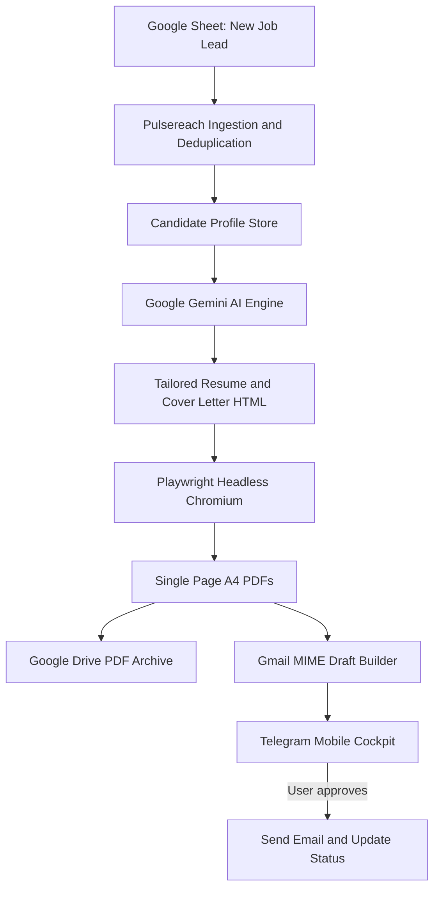

# 🚀 Pulsereach

<div align="center">

[](https://opensource.org/licenses/MIT)
[](https://www.typescriptlang.org/)
[](https://nodejs.org/)
[](https://playwright.dev/)
[](https://aistudio.google.com/)
[](https://supabase.com/)

**Autonomous, Human-in-the-Loop Job Application & Outreach Cockpit.**

*Generates tailored resumes, cover letters, and outreach emails from structured candidate data, then routes everything through a Telegram review workflow before anything is sent.*

[**Human Setup Manual**](docs/SETUP_MANUAL.md) • [**AI Agent Auto-Setup**](docs/SETUP_AI_AGENT.md) • [**Candidate Profile Guide**](docs/PROFILE_GUIDE.md) • [**Architecture Handover**](docs/MASTER_HANDOVER.md)

</div>

---

## 🌟 What is Pulsereach?

**Pulsereach** is an automated job application assistant built for software engineers and technical professionals.

It combines job-lead ingestion, candidate-job matching, AI-assisted document generation, PDF compilation, Gmail integration, and a Telegram-based human review workflow into a single system.

Instead of generating generic application documents, Pulsereach uses a structured candidate profile as the source of truth and adapts each application to the requirements of the target role.

### Core Workflow

1. Ingest job vacancies from a Google Sheet.
2. Deduplicate and process new job leads.
3. Compare job requirements against the candidate profile.
4. Use **Google Gemini** to generate tailored application content.
5. Generate a single-page A4 resume and cover letter.
6. Compile documents into PDFs using Playwright and Chromium.
7. Build an RFC 2822-compatible Gmail draft with the generated documents attached.
8. Send the application to a Telegram Mobile Cockpit for human review.
9. Send the email only after the user explicitly approves the application.

---

## 🏗️ Architecture



### Engineering Invariants

* 🛡️ **Candidate Truth Anchoring:** Generated resumes and cover letters are based strictly on the verified candidate profile.
* 🚫 **Controlled Output Formatting:** Generated documents are validated against formatting rules before delivery.
* 📄 **Single-Page A4 Documents:** Resume and cover letter generation uses A4-specific CSS and automated PDF rendering.
* 📬 **Human-in-the-Loop:** Emails are not dispatched automatically. The user must explicitly approve an application through Telegram.
* 🔐 **Structured Candidate Data:** Candidate information is maintained separately from generated application content to keep the source data consistent.
* 🧪 **Automated Verification:** Candidate data, AI output, document generation, Gmail formatting, and end-to-end workflows are covered by automated tests.

---

## 🚀 Quick Start

### Option A: AI-Assisted Setup 🤖

If you use Cursor, Claude Code, Windsurf, Devin, or another coding agent:

👉 Open [**`docs/SETUP_AI_AGENT.md`**](docs/SETUP_AI_AGENT.md), copy the setup prompt, and provide it to your coding agent.

### Option B: Manual Setup 🛠️

Follow the complete setup guide in [**`docs/SETUP_MANUAL.md`**](docs/SETUP_MANUAL.md).

#### 1. Clone and Install

```bash
git clone https://github.com/AmaanRizwan01/pulsereach.git
cd pulsereach
pnpm install
npx playwright install chromium
cp .env.example .env
```

#### 2. Configure Candidate Profile

```bash
cp profile.example.json profile.json

# Edit profile.json with your projects, experience,
# skills, education, and contact details

pnpm profile:seed
```

#### 3. Verify the Installation

```bash
pnpm typecheck
pnpm test:candidate
pnpm test:deliverability
pnpm test:e2e
```

#### 4. Start the Telegram Cockpit

```bash
pnpm bot:listen
```

---

## 📱 Telegram Mobile Cockpit

Pulsereach uses Telegram as a human review interface.

When a new job lead is processed, the system prepares the application package and sends a review card to the user's Telegram chat.

```text
🚀 Senior Frontend Engineer @ Careem
📍 Dubai, UAE | 🎯 ATS Score: 94/100

📬 To: careers@careem.com
📝 Subject: Application: Senior Frontend Engineer - Your Name

[  ✅ Applied (Send Email)  ]
[  📄 Send CV  ] [  📝 Send CL  ]
[  ⏭️ Skip  ]    [  🚫 Not Relevant  ]
[  🔗 Open Careers Portal  ]
```

### Available Actions

* **`Applied (Send Email)`**: Sends the prepared Gmail draft and updates the application status.
* **`Send CV`**: Sends the generated resume PDF directly to Telegram.
* **`Send CL`**: Sends the generated cover letter PDF directly to Telegram.
* **`Skip`**: Skips the current lead.
* **`Not Relevant`**: Marks the lead as irrelevant.
* **`Open Careers Portal`**: Opens the original job application page.
* **`Next Lead`**: Fetches the next unapplied lead from the configured job source.

---

## 🧪 Verification Suite

Pulsereach includes automated tests covering the major stages of the application pipeline.

```bash
pnpm test:candidate       # Candidate profile and truth-anchoring tests
pnpm test:deliverability  # Email delivery and cooldown logic
pnpm test:ai              # Gemini structured output tests
pnpm test:resume          # Resume generation and validation
pnpm test:cover-letter    # Cover letter generation and validation
pnpm test:pdf             # Playwright A4 PDF generation tests
pnpm test:gmail           # RFC 2822 MIME builder tests
pnpm test:e2e              # End-to-end application workflow
pnpm typecheck            # TypeScript type checking
```

---

## 🧰 Tech Stack

| Technology       | Purpose                                        |
| ---------------- | ---------------------------------------------- |
| TypeScript       | Application development                        |
| Node.js          | Runtime and backend services                   |
| Google Gemini    | AI-powered job analysis and content generation |
| Playwright       | Browser automation and PDF generation          |
| Supabase         | Database and persistent application data       |
| PostgreSQL       | Relational data storage                        |
| Gmail API        | Email draft creation and delivery              |
| Telegram Bot API | Human-in-the-loop review interface             |
| Google Sheets    | Job lead ingestion                             |
| Google Drive     | Document archiving                             |

---

## 🔒 Design Principles

### Candidate Data as the Source of Truth

Pulsereach separates verified candidate information from AI-generated application content. The AI can adapt how experience is presented, but it should not invent qualifications, experience, projects, metrics, or technologies that are not present in the candidate profile.

### Human Approval Before Sending

The system is intentionally not fully autonomous when it comes to sending applications. Every email passes through a Telegram review step, giving the user final control over what gets sent.

### Automated Document Generation

Resume and cover letter documents are generated from HTML/CSS and rendered through Playwright/Chromium, allowing the same application data to produce consistent A4 PDFs.

### Testable Workflows

The application pipeline is split into testable stages so individual components can be validated independently before running the complete end-to-end workflow.

---

## 📄 License

This project is licensed under the [MIT License](LICENSE).

Feel free to star ⭐ the repository, fork it, and adapt it for your own workflow.
